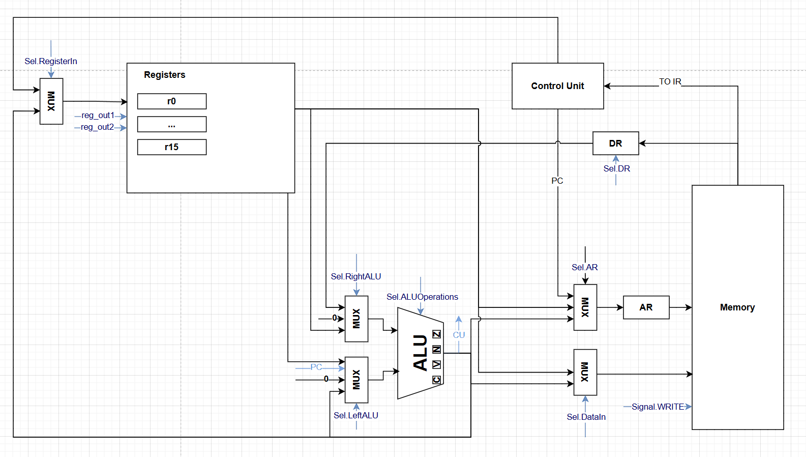

# csa_lab4
- Кузнецов Кирилл P3230
- `lisp | cisc | neum | mc | tick | binary | stream | mem | cstr | prob1 | superscalar`
## Язык программирования
### Синтаксис
```
<program> ::= <expr>*

<expr> ::= <integer>
         | <string>
         | <list-expr>
         | <identifier>

<list-expr> ::= "(" <operator> <expr>* ")"
              | "(" "if" <expr> <expr> <expr>? ")"
              | "(" "let" "(" <binding>* ")" <expr>* ")"
              | "(" "setq" <identifier> <expr> ")"
              | "(" "loop" ("while" <expr>)? "do" <expr>* ")"
              | "(" "defun" <identifier> "(" <identifier>* ")" <expr> ")"
              | "(" ")"

<operator> ::= "+" | "-" | "*" | "/" | "mod" | "and" | "or"
             | "<" | ">=" | "=" | "!=" | ">" | "<="
             | "not" | "print" | "concat" | "list" | "car" | "cdr"
             | "null" | "push" | "nreverse" | "read" | "input-string"
             | <identifier>  ; вызов функции

<binding> ::= "(" <identifier> <expr> ")"

<integer> ::= цифровая константа
<string> ::= '"' последовательность-символов '"'
<identifier> ::= последовательность символов, не включающая пробелы
```
### Семантика 
- Стратегия вычисления - рекурсивная (транслируется сначала вычисление операндов)
- Префиксная нотация (сначала оператор)
- Область видимости: переменные доступны только внутри блока, где были объявлены, хранятся на стеке
- Передача аргументов через стек
- Возврат всех значений через регистр R0: напрямую для численных, по ссылке для списков и строк
- Возврат типа значения в R1: 0 - для числа, 1 - для строки
- Операции
- - (+, -, *, /, mod, and, or) - произвести арифмитическую/логическую операцию над всеми операндами
  -  (>, >=, =, !=, >, <=) - произвести операцию сравнениях операндов
  -  not - вернуть 0, если операнд != 0, иначе 1
  -  print - вывести число или строку
  -  concat - конкатенация двух строк (создается новая, возвращается ссылка на нее)
  -  read - читается одно машинное слово из ввода
  -  input-string - читается и сохраняется си-строка, как массив машинных слов
  -  list - создается список из целочисленных элементов, возвращается ссылка на него
  -  null - проверить пустой ли список
  -  car - вернуть первый элемент списка, вернется в R0
  -  cdr - вернуть ссылку на второй элемент списка
  -  push - добавить элемент в начало списка и вернуть на него ссылку
  -  nreverse - развернуть список, создается новый список и возвращается ссылка на него
## Организация памяти
 - Архитектура фон Неймана.
 - Память адресуется побайтово.
 - Размер машинного слова - **32 бита**
 - Строки хранятся, как массив машинных слов
 - Списки - каждый элемент два слова: значения и адрес следующего
 - ### Разделы памяти
   - Инструкции хранятся в области `.text` (начинается с 0), причем 
       - В конце секции находятся все объявленные функции, а также все функции стандартные для языке
       - - Вызовы функций по IMMEDIATE значению, переходы внутри по PC + OFFSET
       - Программа завершается инструкцией `HALT`
       - Функции завершаются RET reg, где reg - регистр возврата
   - Константные строки данные хранятся в `.data` (идет сразу за `.text`), числовые константы, а также константные списки отсутствуют
   - Динамические строки, списки хранятся в `heap` (начианя с 0x3000), куча никогда не очищается, растет вверх
   - Ссылки и числовые значения переменных хранятся на стеке, а также все аргументы перед вызовом функции, растет "вниз"
```plaintext
0x0000 ┌───────────────┐  
       │  Текст (код)  │  
0x.... ├───────────────┤  
       │    Данные     │  
0x.... ├───────────────┤  
       │     Куча      │  ↓ (R13)  
0x3000 ├───────────────┤  
       │     Стек      │  ↑ (R15)  
0x9000 └───────────────┘
```
   - ### Регистры
   - `R0`,...,`R15` - регистры общего назначения: при трансляции `R15` используется, как указатель стека, `R14` - как регистр возврата, `R13` - heap pointer
   - `AR` - 4 байта
   - `DR` - 4 байта
   - `IR` - 2 байта
   - `PC` - 4 байта
   - `mPC`
## Система команд
- Доступ к памяти осуществляется по адресу, хранящемуся в специальном регистре `address_register`. Значение в него может передаваться либо из PC, либо из результата ALU.
- В data_register может быть загруженно либо все машинное слово, либо 2 младших байта
 - ### Инструкции переменной длины, operand type:
 - - 2 байта - REG2REG адрессация (пример ADD R1, R2)
   - 4 байта - косвенная относительная адрессация - `[REG + n]` (`ADD R1, [R15 + 4]`), (`STORE [R15 + 4], R1`); а также адрессация смещением PC `PC + OFFSET` (`JMP 16`)
   - 6 байт - непосредственная адрессация (`ADD R1, 10`)
 - Поток управления: условные (`BE`, `BNE`, `BGE`, `BG`, `BL`, `BLE`), безусловные (`JMP`)
 - ### Циклы исполнения
 - - instruction fetch - 3 такта
   - operand fetch - 1-4 такта (Reg2Reg - 1; Reg, [Reg + n] - 4; Pc + offset - 2; Reg, Imm - 4)
   - `HALT` - остановка симуляции, 1 такт + `operand fetch`
   - `ADD`, `SUB`, `DIV`, `MUL`, `RMD`, `NOT`, `AND`, `OR`, `XOR` - операции АЛУ, 2 такта + `operand fetch`
   - `CMP` - 1 такт + `operand fetch`,
   - `STORE [Reg1 + n], Reg2` - сохраняет значение регистра `Reg2` в память по адресу `Reg1 + n`, ровно 3 такта
   - `STORE_IMM IMM, Reg2` - сохраняет значение `Reg2` по адрессу `IMM` - 2 такта + `operand fetch`
   - `CALL Reg1, operand` - `Reg1 = PC`, `PC = operand` - 1 такт + `operand fetch`
   - `RET Reg1` - `PC = Reg1` - 1 такт + `operand fetch`
   - `BE`, `BNE`, `BG`, `BGE`, `BL`, `BLE`, `JMP` - инструкции перхода - 1 такт + `operand fetch`
- ### Бинарное представление Instruction Register
```plaintext
┌──────────┬───────────────────┬─────────┬─────────┐
│ 15...10  │ 9,8               │ 7...4   │ 3...0   │             
├──────────┼───────────────────┼─────────┼─────────┼
│  opcode  │operands type      │  REG1   │  REG2   │
└──────────┴───────────────────┴─────────┴─────────┴
```
## Транслятор
```
translator.py input output.bin
input - входной файл с ассемблерным кодом
output.bin - бинарный файл, в который будет транслироваться код, так же
будет сделан output.bin.hex с мнемониками и 16-ричной трансляцией кода
```
1. Создание AST: строится ast, возвращающее на выходе массив, каждый элемент массива - expression, expression может состоять из других expressionов, строки берутся в двойные кавычки, числа - int
2. Транслятор проходит по каждому выражению из аст и транслирует его рекурсивно
   - Метки не подставляются на этом этапе, но идет их вычисление
   - На стек сохраняются только регистры `R7`, `R14`. `R15` - sp, `R13` - heap pointer, все остальные могут изменяться в процессе работы.
   - `read`, `input-string`, `nreverse`, `push`, `null`, `cdr`, `car`, `list`, `concat`, `print` - всегда возвращают результат в `R0`
   - Методы транслирующее встроенные конструкции языка (арифмитические, логические и операции сравнения, `if`, `let`, `setq`, `...`) принимают регистр, в котором будет возвращенно значение, а также словарь локальных переменных {имя: адрес}
   -  Арифмитические, логические и операции сравнения накапливают значение в регистре R7, при этом вызывают трансляцию с возвратом значения операнда на регистр R2 и R3. Возвращают результат в переданном, в качестве аргумента регистре, аналогичным образом работают и другие конструкции
   -  defun объявляет функцию и сохраняет метку в массив меток, считает, что аргументы уже лежат на стеке.
   -  (`<identifier>`) - вызов функции сохраняет R14 и аргументы функции на стек, вызывает функцию
   -  строки транслируются в секцию данных методом `compile_string`, возвращается указатель в `return_reg`, переданный как аргумент функции
   -  строки, записываемые программой, а также списки транслируются в heap, при этом heap_pointer увеличивается на длину строки/списка
   -  immediate value записывается в return_reg, переданный как аргумент функции
3. Замена меток. После трансляции всех выражений метки заменяются на адресса. При этом внутри блоков переход проихсодит при помощи Pc + Offset, вызов через immediate value
4. Сохранение результатов
   - Исходный код читается из файла.
   - Переводится в список инструкций.
   - Генерируются два представления:
   - - бинарное (.bin);
   - -шестнадцатеричное (.hex).
   - Все сохраняется по указанному пути
## Модель процессора
```plaintext
machine.py target.bin input [char_io]
target.bin - входной файл с бинарным кодом
input - файл ввода
char_io = 0/1 - поток ввода состоит из машинных слов (0) или символов (1)
```
### Особенности реализации
Микропрограммное управление: 42-битный микрокод, в коде считаем, что все не указанные биты равны 0  
Сигналы реализованы, как enum `Signal` и enum `Sel`

---
 
**0. Signal.SELECT_LEFT_ALU:**  
- [0] `Sel.LeftALU.REGISTER` - Из выбранного регистра (`reg_out2`)  
- [1] `Sel.LeftALU.ALU` - Из прошлого результата ALU  
- [2] `Sel.LeftALU.ZERO` - 0  
- [3] `Sel.LeftALU.PC` - Из PC
  
**4. Signal.SELECT_RIGHT_ALU:**  
- [4] `Sel.RightALU.REGISTER` - Из выбранного регистра (`reg_out1`)  
- [5] `Sel.RightALU.DR` - Из DR  
- [6] `Sel.RightALU.ZERO` - 0
  
**7. Signal.EXECUTE_ALU:**  
- [7] `Sel.ALUOperations.ADD`  
- [8] `Sel.ALUOperations.SUB`  
- [9] `Sel.ALUOperations.MUL`  
- [10] `Sel.ALUOperations.DIV`  
- [11] `Sel.ALUOperations.RMD`  
- [12] `Sel.ALUOperations.AND`  
- [13] `Sel.ALUOperations.OR`  
- [14] `Sel.ALUOperations.XOR`  
- [15] `Sel.ALUOperations.NOT`
  
**16. Signal.LATCH_FLAGS**  

**17. Signal.LATCH_REGISTER**  
- [17] `Sel.RegisterIn.ALU` - Из результата ALU  
- [18] `Sel.RegisterIn.PC` - Из PC
  
**19. Signal.CHECK_CONDITION**  
- [19] `Sel.Condition.ZERO` - Из Z-флага  
- [20] `Sel.Condition.GREATER` - Из равенства V == N  
- [21] `Sel.Condition.GREATER_EQUALS` Из V == N and Z == 1  
- [22] `Sel.Condition.NONE` - Считаем, что условие выполнено (нужно для JMP)
  
**23. Signal.LATCH_PC**  
- [23] `Sel.PC.ALU` - Из результата ALU  
- [24] `Sel.PC.PLUS_TWO` - PC = PC + 2  
- [25] `Sel.PC.PLUS_FOUR` - PC = PC + 4  
- [26] `Sel.PC.BRANCH_CONDITION` - PC = ALU if branch_condititon = 1  
- [27] `Sel.PC.BRANCH_CONDITION_INVERSE` - PC = ALU if branch_condititon = 0
  
**28 Signal.LATCH_mPC**  
- [28] `Sel.MicroPC.OPCODE` - Instruction Decoder декодирует старшие 6 бит в IR и передает результат в mPC  
- [29] `Sel.MicroPC.OP_FETCH` - Instruction Decoder декодирует биты 8-9 и передает результат в mPC  
- [30] `Sel.MicroPC.ZERO` - mPC = 0  
- [31] `Sel.MicroPC.PLUS_ONE` - mPC = mPC + 1
  
**32 Signal.LATCH_AR**  
- [32] `Sel.AR.REGISTER` - Из выбранного регистра (`reg_out1`)  
- [33] `Sel.AR.ALU` - Из результата ALU  
- [34] `Sel.AR.PC` - Из PC
  
**35 Signal.LATCH_DR**  
- [35] `Sel.DR.LOW` - Загрузить младшие два байта из памяти по адресу из AR  
- [36] `Sel.DR.FULL` - Загрузить машинное слово из памяти по адресу из AR
  
**37 Signal.WRITE** - Записать машинное слово по адресу в AR  
- [37] `Sel.DataIn.Register` - Машинное слово возьмется из выбранного регистра (`reg_out1`)  
- [38] `Sel.DataIn.ALU` - Машинное слово возьмется из резульатат ALU
  
**39 Signal.SELECT_REGS**: Выбрать регистры, номера которых указаны в младшем байте IR (reg_ou1 - 4..7 биты, reg_out2 - 0..3 биты) 

**40 Signal.LATCH_IR**  

**41 Signal.HALT**  

### Datapath  

Реализовано в классе `Datapath`
### ControlUnit

Реализовано в классе `ControlUnit`
## Тестирование
Тестирование выполняется при помощи golden test-ов.
Тесты реализованы в [golden_test.py](golden_test.py)
Конфигурации:
- [golden/cat.yml](golden/cat.yml)
- [golden/bigint.yml](golden/bigint.yml)
- [golden/factorial.yml](golden/factorial.yml)
- [golden/hello_username.yml](golden/hello_username.yml)
- [golden/hello_world.yml](golden/hello_world.yml)
- [golden/max_palindrom.yml](golden/max_palindrom.yml)
- [golden/sort.yml](golden/sort.yml)
- [golden/statement.yml](golden/statement.yml)
